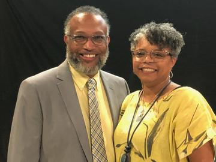

# Leadership Team

Silver Hill Memorial UMC is blessed with dedicated leadership committed to serving God and our community.

## Pastor

### Rev. Morris Waymer, Jr.

{ .pastor-photo }

Reverend Morris Waymer Jr., a man deeply rooted in family values, was born and raised in Orangeburg, SC, where his parents still reside. His commitment to family is a cornerstone of his life. He is married to the former Nickey Hallums of Easley, SC, and they have been blessed with two daughters, Ivery and Kierston, one son, London, and five grandchildren, who bring them immense joy and love.

**Education & Experience:**
- Bachelor's in Biology from Claflin College
- Master of Divinity Degree from Emory University
- Pastor in the South Carolina Annual Conference since 1999
- Extensive experience serving churches in the Upstate, Pee Dee, and Lowcountry

**Ministry Focus:**
Rev. Waymer believes ministry involves serving both the church and its surrounding community. His leadership philosophy centers on:

- **Servant Leadership** - Working with organizations and members, leading by example
- **Active Listening** - Understanding that people need to be heard and offered grace and compassion
- **Community Engagement** - Participating in local ministries and outreach programs
- **Racial Reconciliation** - Advocating for unity and understanding in our community

**Past Service:**
- Chaplain of the Interdenominational Ministerial Alliance
- Leader in the North Hope Cooperative Ministry, raising funds for local ministries
- Advocate for community collaboration and elementary school outreach

Rev. Waymer never takes credit for his accomplishments, always saying, *"To God be the Glory for the great things He has done."*

## Lay Leadership

### Administrative Council
Our Administrative Council provides oversight and direction for all church ministries and operations.

### Trustees
The Board of Trustees manages the physical facilities and property of the church.

### Finance Committee
Our Finance Committee oversees the church's financial resources and stewardship.

### Staff-Parish Relations Committee
This committee supports our pastoral staff and manages personnel matters.

## Ministry Leaders

### Worship Ministry
Our worship leaders help create meaningful worship experiences that honor God and inspire the congregation.

### Music Ministry
Our music team leads congregational singing and provides special music throughout the year.

### Children & Youth Ministry
Dedicated volunteers work with our young people to help them grow in faith and service.

### Missions & Outreach
Our missions team coordinates local and global outreach efforts.

## How to Get Involved

We believe every member has gifts to share in ministry. Leadership opportunities are available in:

- Worship planning and participation
- Teaching and mentoring
- Administrative support
- Facilities and grounds care
- Community outreach programs

## Contact Leadership

If you would like to speak with Rev. Waymer or learn more about leadership opportunities, please call the church office to schedule an appointment. We are looking forward to meeting you!

---

*"Each of you should use whatever gift you have to serve others, as faithful stewards of God's grace in its various forms." - 1 Peter 4:10*