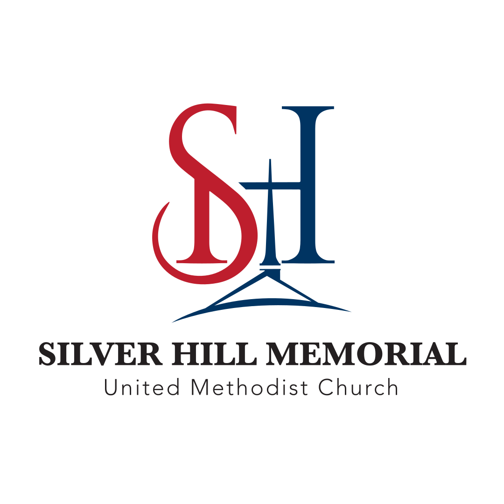

# Brand Guidelines

Welcome to the official brand guidelines for Silver Hill Memorial United Methodist Church. This page provides our complete visual identity system, including colors, logos, and usage guidelines.

## Official Brand Colors

Our brand colors are carefully chosen to reflect our church's values and create a cohesive, professional appearance across all communications.

### Primary Colors

<strong>Crimson Red</strong> 
#be1e2d 
<small>Primary brand color from the "S" Use for: Hyperlinks, accents, call-to-action buttons</small>

<strong>Content Text</strong> 
#231f20 
<small>Primary text color from logo Use for: Body text, headings, main content</small>

<strong>Navy Blue</strong> 
#003462 
<small>From the "H" with cross Use for: Accent elements (sparingly)</small>

### Supporting Colors

<strong>Gold Accent</strong> 
#d4a574 
<small>From mountain element Use for: Special highlights, celebrations</small>

<strong>Light Gray</strong> 
#f5f5f5 
<small>Background color Use for: Backgrounds, subtle sections</small>

<strong>Medium Gray</strong> 
#9ca3af 
<small>Border and divider color Use for: Borders, dividers, subtle elements</small>

## Logo Variations

Our church logo is available in multiple formats to ensure versatility across different applications and backgrounds. All logos have been professionally designed and should be used exactly as provided.

### Main Logo (Full Color)

{ style="max-width: 400px; padding: 2rem; border-radius: 0.5rem;" }

**Use when:** Primary brand applications, full color reproduction  
**Files:** `shmumc-logo-main.svg` (preferred), `shmumc-logo-main.png`, `shmumc-logo-main.jpg`  
**Best for:** Website headers, letterhead, primary brand materials

---

### Main Logo - Black Version

{ style="max-width: 400px; background: white; padding: 2rem; border-radius: 0.5rem; box-shadow: 0 2px 8px rgba(0,0,0,0.1);" }

**Use when:** Single color printing, high contrast needed  
**Files:** `shmumc-logo-main-black.svg` (preferred), `shmumc-logo-main-black.png`, `shmumc-logo-main-black.jpg`  
**Best for:** Print materials, fax headers, single-color applications

---

### Circular Logo - Blue

{ style="max-width: 200px; padding: 1rem; border-radius: 0.5rem;" }

**Use when:** Social media profiles, round applications  
**Files:** `shmumc-logo-circle-blue.svg` (preferred), `shmumc-logo-circle-blue.png`, `shmumc-logo-circle-blue.jpg`  
**Best for:** Social media avatars, app icons, badges

---

### Circular Logo - Black

{ style="max-width: 200px; background: white; padding: 1rem; border-radius: 0.5rem; box-shadow: 0 2px 8px rgba(0,0,0,0.1);" }

**Use when:** Single color circular applications  
**Files:** `shmumc-logo-circle-black.svg` (preferred), `shmumc-logo-circle-black.png`, `shmumc-logo-circle-black.jpg`  
**Best for:** Single-color stamps, embossing, engraving

---

### Circular Logo with Text

{ style="max-width: 200px; padding: 1rem; border-radius: 0.5rem;" }

**Use when:** Circular format with full church name needed  
**Files:** `shmumc-logo-circle-words.svg` (preferred), `shmumc-logo-circle-words.png`, `shmumc-logo-circle-words.jpg`  
**Best for:** Official seals, formal documents, certificates

## File Format Guidelines

### SVG (Recommended)
- **Best for:** Web use, scalable applications
- **Benefits:** Perfect quality at any size, small file size
- **Use when:** Digital applications, responsive design

### PNG  
- **Best for:** Digital use with transparency needs
- **Benefits:** High quality, transparent backgrounds
- **Use when:** Digital graphics, presentations

### JPG
- **Best for:** Print materials, photos
- **Benefits:** Smaller file sizes for complex images
- **Use when:** Print layouts, email attachments

## Logo Usage Guidelines

### Do's

✅ **Maintain clear space** around the logo equal to the height of the "S"  
✅ **Use official color versions** whenever possible  
✅ **Scale proportionally** - never stretch or distort  
✅ **Ensure good contrast** against backgrounds  
✅ **Use high-resolution files** for print materials  

### Don'ts

❌ **Don't change the colors** unless using approved single-color versions  
❌ **Don't add effects** like drop shadows, outlines, or glows  
❌ **Don't place on busy backgrounds** that compromise legibility  
❌ **Don't use low-resolution versions** for large formats  
❌ **Don't alter the proportions** or spacing of elements  

## Typography

### Primary Font
**Georgia** - Used in logo and formal documents  
Serif font that conveys tradition and reliability

### Web Font
**System fonts** - Optimized for web readability  
Falls back to: -apple-system, BlinkMacSystemFont, "Segoe UI", Roboto, sans-serif

## Applications

### Digital Applications
- Website headers and navigation
- Email signatures  
- Social media profiles and posts
- Digital presentations
- Online documents

### Print Applications
- Letterhead and business cards
- Brochures and flyers
- Banners and signage
- Program covers
- Official documents

### Merchandise
- Clothing and apparel
- Promotional items
- Church supplies
- Gifts and memorabilia

## Brand Voice

Our visual identity should reflect our church values:

- **Welcoming** - Open and inclusive design
- **Traditional** - Respectful of Methodist heritage  
- **Professional** - Clean and organized presentation
- **Warm** - Friendly and approachable
- **Faithful** - Consistent and reliable

## Questions?

For questions about brand usage or to request additional logo formats, please contact:

- Church office: [Contact information]
- Communications team: [Email]
- Website team: [Email]

---

*These brand guidelines ensure consistent, professional representation of Silver Hill Memorial United Methodist Church across all communications and materials.*